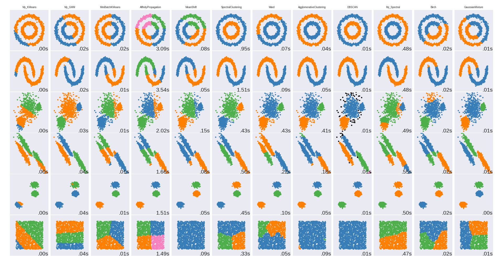
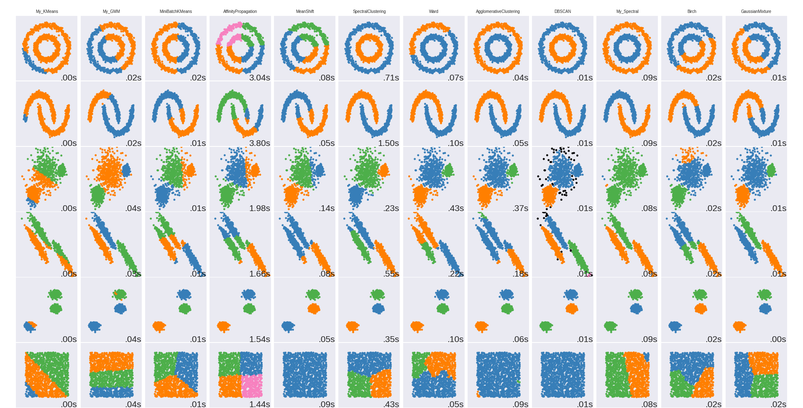
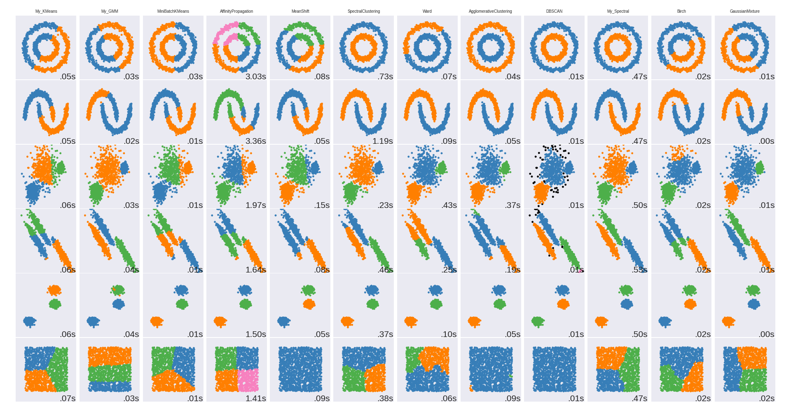

Assignments --clustering

1. KNN

算法的实现比较naive，初始中心点的选择采用了(max-min/k) 这种方式，目的是想让初始的中心分布更加离散。采用的终止条件为每一个类的index不再变化。

2. EMM

针对KNN的局限性，只能用圆形来表示一个聚类，EMM可以采用高斯分布（椭圆形）来表示每一个类的分布，并且每一个点可能对应不同的类有不同的概率。

在实现过程中，协方差的计算要考虑不同点的权重。最后类别的确定不应该以到哪个中心点最近为标准，而是应该考虑哪个类对应的weight比较大。

在初始化的过程中，采用和knn同样的方法初始化出现了报错，所以采用了选择数据点来初始化的方法。

此外，在对log likelihood的观察中发现，迭代数次后，log likelikhood保持稳定，但是得到的中心点位置和真实值仍有一定差距，我的理解是log likelihood陷入了局部最优，然后无法进一步优化。

3.Spectral clustering

实现过程中采用了fully connected的模式，可能这是造成对应的结果不理想的原因，在对于similiarity matrix的赋值中，如果采用双循环，由于python的特性，效率极低，所以应该尽量避免，可以利用broadcast特性赋值。

在采用fully connected的模式下，如果使用nomalized spectral clustering，效果更差，unnomalized 反而效果更好。

在对distance map计算的过程中，如果采用倒数，需要解决分母为0的问题，所以用guassion distribution可能是一种更好的解决方式，或者用max（data）-element也可以得到可行的结果。 

spectral clustering在main函数的小数据中表现正常，但是在测试文件中表现不佳。

后来经过改善，发现，通过修改distance map对应的gaussion的sigma，以及采用knn，而不是fully connected来定义distance map时，效果有很大差别。

下图是采用knn（k=20），gaussion 的sigma=1 对应的表现

下图是fully connected状态下，sigma=0.1的时候，对应表现，其他参数下不佳的结果就不展示了。

相关假设： distance map需要有效反映出不同数据点间的区别时，才能有更好的分类效果。

**UPDATE**

针对KMeans进行了更新，初始化时将data进行了一次sort，然后选择均匀的间隔对index采样作为聚类中心。KMeans的终止条件也修改了，改为连续两次分类结果一致时，才进行终止。

