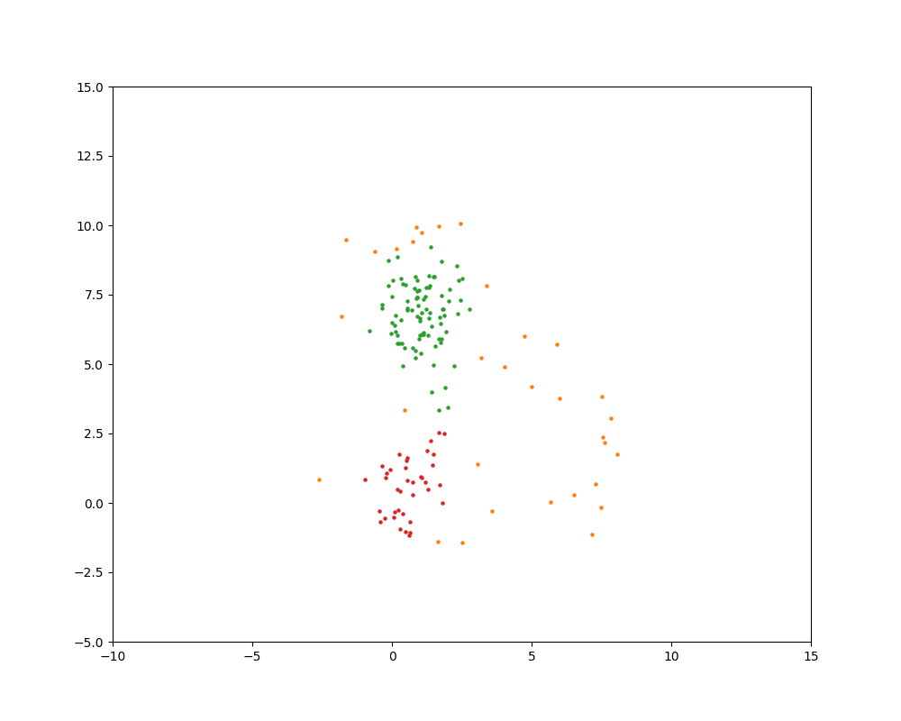

# **Clustering作业报告**

本次作业主要实现了Ransac和DBSCAN两种算法。

本次报告主要解释implement过程中的一些细节思考和结果呈现。

## Ransac

* 在求法向量时，采用了SVD分解，找最小eigenvalue对应的向量值，这种方法的优点在于可以通过3个以上的点来估计平面法向量
* 在进行ransac迭代时，采用了每次随机选择subset，在subset内估计平面的方法，这种方法的好处在于避免数据点数目极大，造成迭代效率低的问题.
* ransac 效果见下图

## DBSCAN

自己实现了dbscan算法，如下图所示，但是有如下问题：

* 出现了点的遗漏
* 因为采用了递归的思路，当数据过大时，python无法执行，会报错。

## Clustering

因为自己实现的dbscan效果不佳，最后采用了ransac + dbscan调库的方式。个人感觉还算可以。

## TODO：

* debug dbscan
* use Spectral clustering for testing
