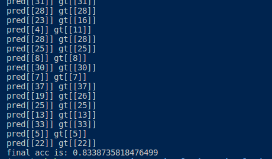
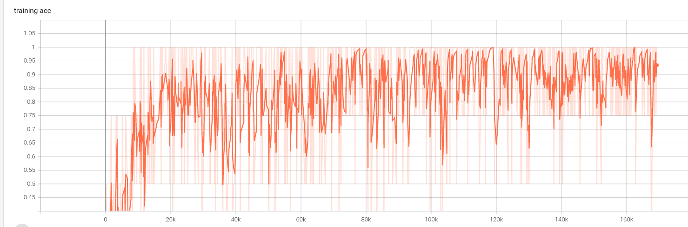
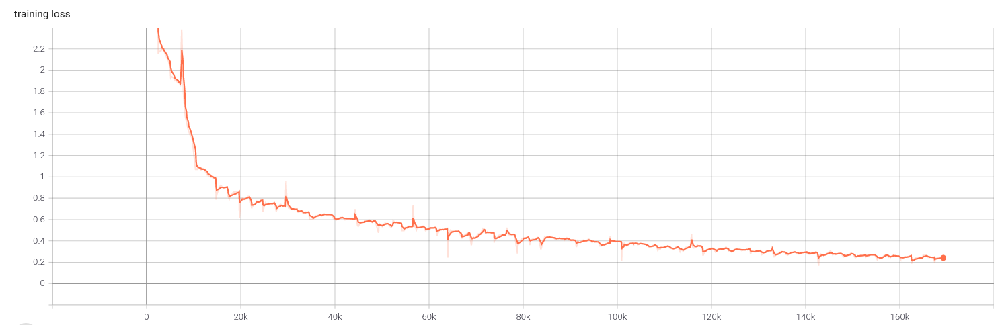

# 作业结果

分别尝试以batchsize =1 ，batchsize =4 进行训练。

因为为1时，一直没有观察到loss收敛而选择了中断，最后以batchsize =4 进行训练。

得到测试结果为准确率： 83.38%。



## Benchmark

Accuracy




Loss




# 作业备注：

## 数据集类的构建：

1. `__getitem__`的使用简化了查看具体数据属性的流程，在本程序中，传入index，对应就会输出特征和标签。
2. label在刚开始时是string的形式，后来改变为一个包含一个1，其他都是0的Tensor

## 网络模型类构建

### 1.继承官网的nn.module

*CLASS* `torch.nn.Module`

Base class for all neural network modules.

Your models should also subclass this class.

Modules can also contain other Modules, allowing to nest them in a tree structure. You can assign the submodules as regular attributes:

The module `torch.nn` contains different classess that help you build neural network models. All models in PyTorch inherit from the subclass `nn.Module`, which has useful methods like `parameters()`, `__call__()` and others.

This module `torch.nn` also has various *layers* that you can use to build your neural network. For example, we used `nn.Linear` in our code above, which constructs a fully connected layer. In particular,

### 2.常用网络层

#### Conv1d

Applies a 1D convolution over an input signal composed of several input planes.

```
nn.Conv1d(in_channels=n_freq, out_channels=n_hidden, kernel_size=kernel_size, bias=False),
```

#### Linear

`nn.Linear(in_features, out_features, bias=True)`

Applies a linear transformation to the incoming data: y = x*W^T + b

Note that the weights W have shape (out_features, in_features)
and biases b have shape (out_features).
They are initialized randomly and can be changed later
(e.g. during the training of a Neural Network they are updated by some optimization algorithm).

#### BatchNorm1d

reference:

`https://machinelearningmastery.com/batch-normalization-for-training-of-deep-neural-networks/#:~:text=Batch%20normalization%20is%20a%20general,Networks%20and%20Recurrent%20Neural%20Networks.`

Batch normalization is a general technique that can be used to normalize the inputs to a layer.

It can be used with most network types, such as Multilayer Perceptrons, Convolutional Neural Networks and Recurrent Neural Networks.

#### RELU

Applies the rectified linear unit function element-wise:

ReLU(x)=max(0,x)

#### Dropout

During training, randomly zeroes some of the elements of the input tensor with probability `<span class="pre">p</span>` using samples from a Bernoulli distribution. Each channel will be zeroed out independently on every forward call.

常用函数

#### View

PyTorch allows a tensor to be a `<span class="pre">View</span>` of an existing tensor. View tensor shares the same underlying data with its base tensor. Supporting `<span class="pre">View</span>` avoids explicit data copy, thus allows us to do fast and memory efficient reshaping, slicing and element-wise operations.

Returns a new tensor with the same data as the `<span class="pre">self</span>` tensor but of a different  shape

The returned tensor shares the same data and must have the same number of elements, but may have a different size. For a tensor to be viewed, the new view size must be compatible with its original size and stride,

#### Softmax

Applies the Softmax function to an n-dimensional input Tensor rescaling them so that the elements of the n-dimensional output Tensor lie in the range [0,1] and sum to 1.

As stated in the [`torch.nn.CrossEntropyLoss()`](https://pytorch.org/docs/stable/nn.html#crossentropyloss) doc:

> This criterion combines [`nn.LogSoftmax()`](https://pytorch.org/docs/stable/nn.html#logsoftmax) and [`nn.NLLLoss()`](https://pytorch.org/docs/stable/nn.html#nllloss) in one single class.

## TODO

1. pytorch 60 min 重新看一遍，感觉对很多函数还是不熟悉
2. 熟悉数据预处理步骤，看看是否能通过调整预处理方式增加训练效果---dataset.py
3. 学习debug方式，解决因为数据加载时间长导致debug效率低的问题
4. 使用`softXEnt`来替代交叉熵
