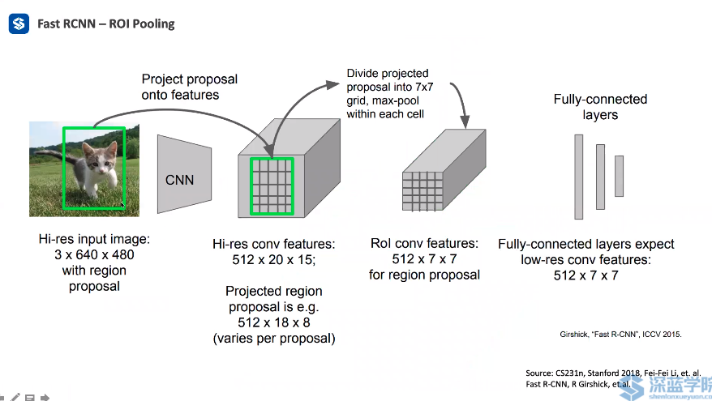

## Introduction of object detection

1. Image Based object detector
3. VoxelNet & PointPillars
4. Point Cloud - PointRCNN

input: Point Cloud & Images

Output: 3D bounding boxes [x,y,x length, width,height, heading, category]

三维的方法主要来自于二维.

Two procedures of object detection: Object Localization, Object Classification.

DL cannot solve any problem, that is the reason why we should learn clustering, segmentation, etc.

In the point cloud data, there are no problems about scale and illumination compared with image.

Performance Metric:

Intersection over Union: determine whether a predicted box is matched with the ground truth box.

Precison & Recall

True: 你做对了

False: 你做错了

Positive: 检测出来了

Negative： 没有检测出来

Precision: 检测出来的有多少是对的

Recall: 漏掉了该检查出来的

mAP:  Mean over all categories

TP: IoU > Threshold & High

Non-maximum Suppression (NMS)

Usually there are multiple predicted boxes on one object

Selcet the one with highest predicted score

The larger is threshold, the more boxes NMS keeps

TODO: 实现NMS

1. Keep all preicted boxes in the input list
2. sort the predicted boxes by confidence
3. pick the highest one, add it to the output list, remove it from the input list
4. iterate all boxes in the input list. a. compute IoU between the picked box. b. If IoU > threshold, remove the box from the input list.
5. Repeat step 3,4 until the input list is empty
6. Output list is the result

## Image based object detection

Detection = Localization + Classification

### RCNN

Region  Proposal (color..), amount: 2k

* Region of interest from a proposal
* warped image regions
* shared CNN
* Softmax

### FastRCNN

* CNN =>The feature map
* regions of interest
* ROI Pooling (in the feature map) (max pooling)
* CNN/MLP
* Boc regression => L2/L1 Loss
* Box Classification =>Softmax Loss

## PointRCNN

a. Bottom-up 3D Proposal Generation

骨干网络得到feature vector

RPN得到是前景还是背景的判断

ROI pooling

 每一个proposal做一次refinement

b. Canonical 3D Box Refinement

Regional convolutional network

PointNet++==>point-wise feature vector

RPN - per-point

ROI pooling 

核心思想： 前景背景分割

### Stage 1:

Foreground: Points inside ground truth boxes

Background: other points

Loss function: focal loss

Stage 2  ROI Pooling

* NMS on the stage 1 proposals
* Enlarge the stage 1 proposals
* get information in the enlarged box
  * Point coordinate(canonical transformation: normalize points, rotate points
  * Point intensity
  * Point's distance to origin
  * Foreground/ Background prediction
  * Per-point features from Pointnet++
*
