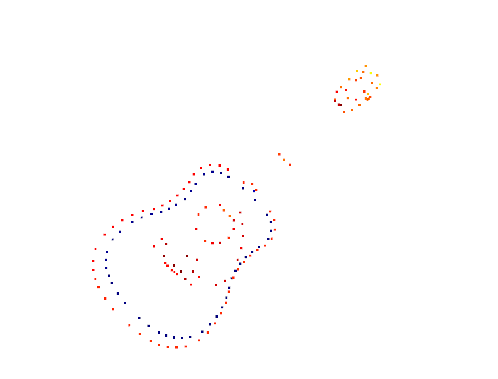
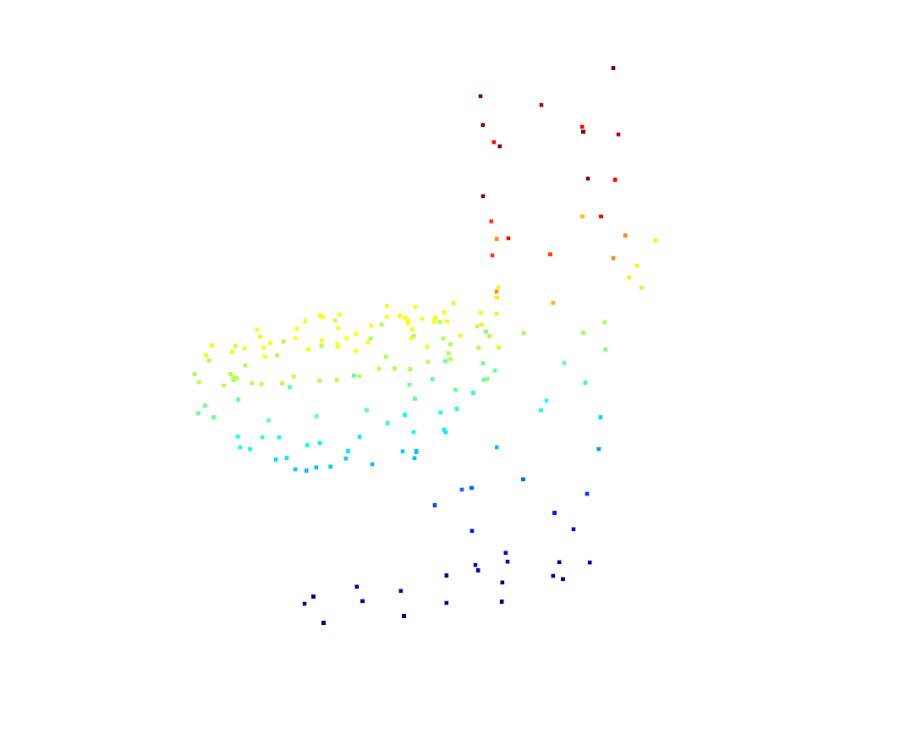
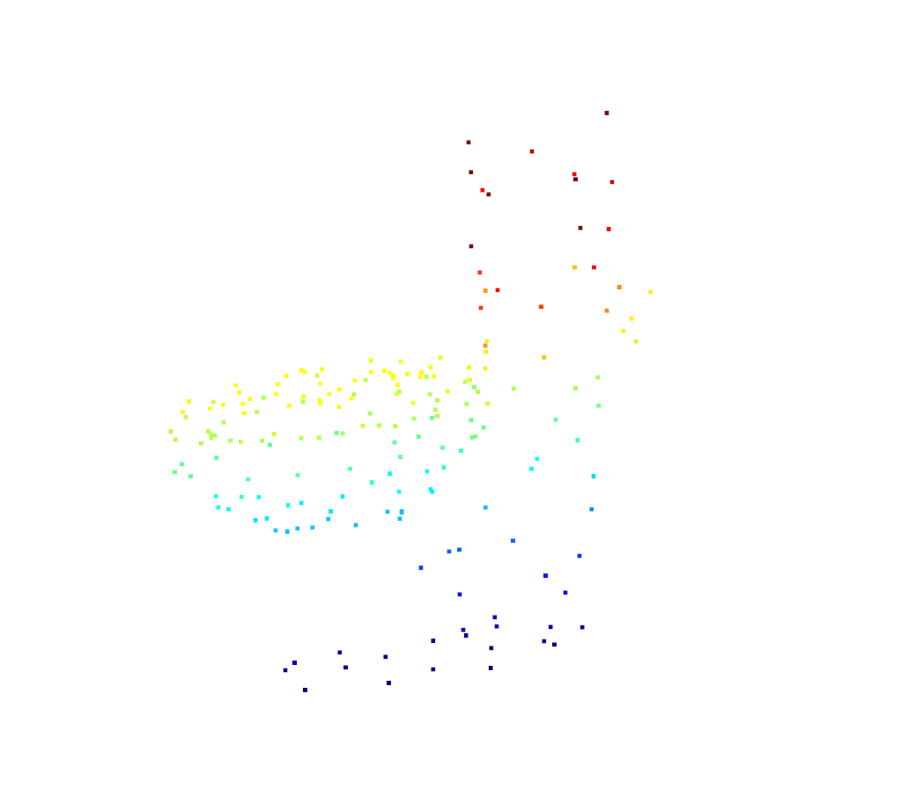
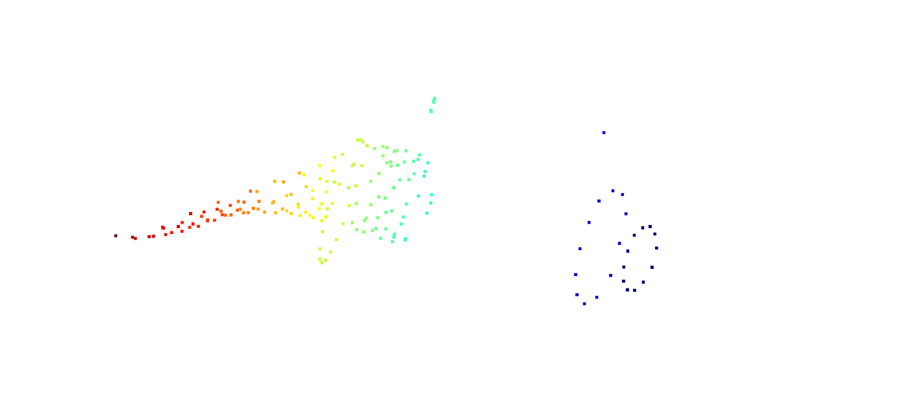
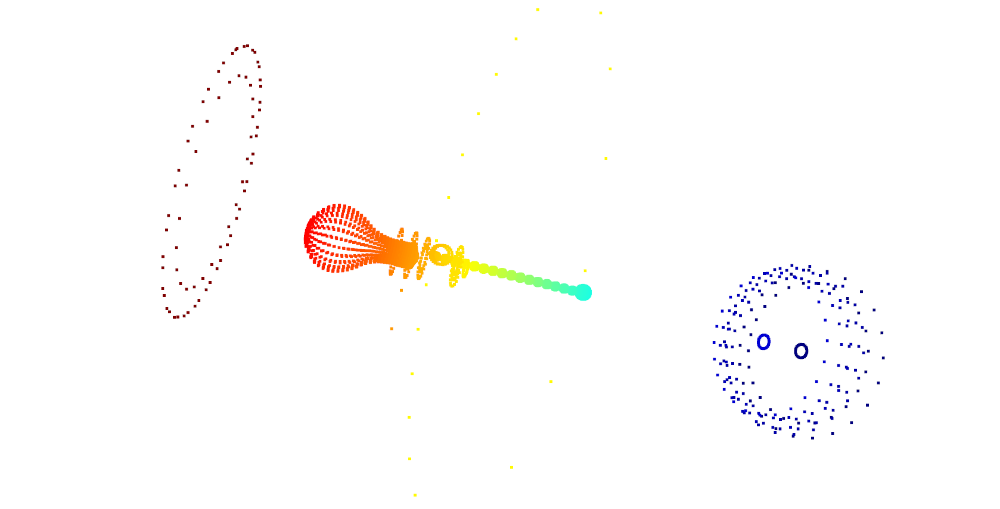

ISS 算法步骤梳理；

* get the set of candidate points
  * calculate the **weight covariance matrix** over a **radius r**, the weight depends on the number of its neighbors, inversely related to the number of points in its neighborhood within r
  * compute the eigenvalues and filter out the line and flat square points via lambda1,2,3, you should set two thresholds here.
  * Store the value of lambda in a dict. Store the indexs of candidate points in a list
* get the set of key points -- Non Maximum suppression
  * find the maximum lambda and its index
  * store the index in the set of iss key points. delete it and its neighbor in the candidate list and dict.
  * continue to find the maximum value in the left set, until cand_idxs is large enough or cand_idxs is void.

Performance:

Example 1

Example 2

Example 3

