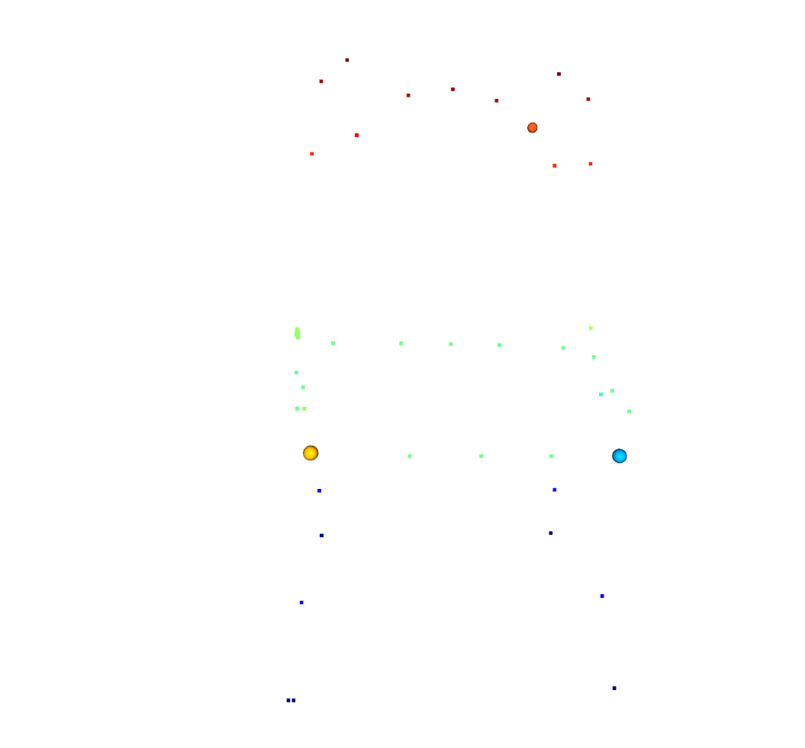
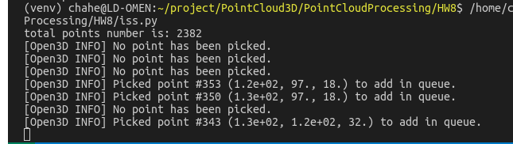
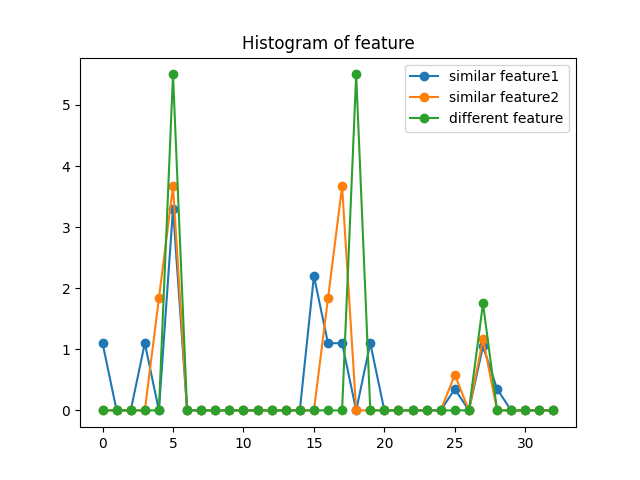

# 3D点云处理第8章作业

## 目标

针对点云特征点提供合理的描述子

## 准备

1. 重构上一章ISS特征点提取算法，以及此前的PCA和平面法向量提取算法，分别放置到iss.py 和pca.py中
2. 通过iss算法提取特征点，通过open3d edit模式可以选择点，得到对应index,找一个位置不一样的点进行对比。

之后，我们通过他们在iss特征点几何中的idx，可以得到他们在全部数据中的index。

两个相似的特征点对应的坐标275 248，作为对照的点的坐标 2154

## 执行

在下图中，绿色为取自光滑区域的非特征点，可以看出feature1，feature2相似度较高，符合预期。

但是。。。区别没有想象中显著。

FPFH效果：

