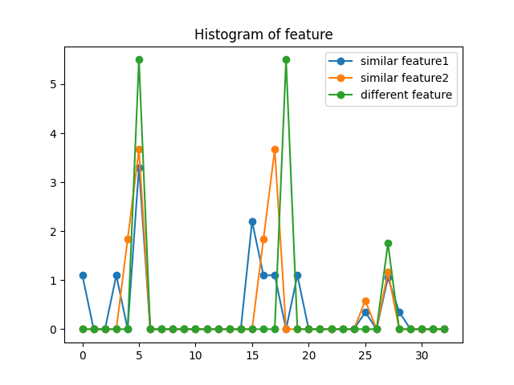
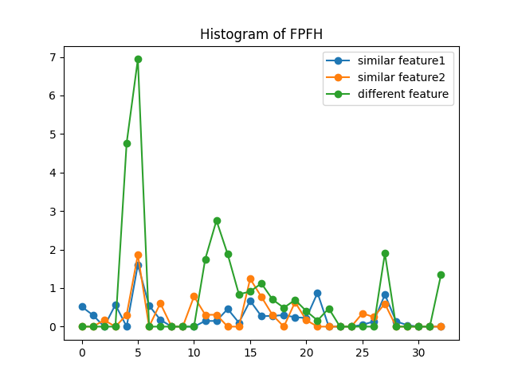

# 3D点云处理第8章作业

## 目标

针对点云特征点提供合理的描述子

## 准备

1. 重构上一章ISS特征点提取算法，以及此前的PCA和平面法向量提取算法，分别放置到iss.py 和pca.py中
2. 通过iss算法提取特征点，通过open3d edit模式可以选择点，得到对应index,找一个位置不一样的点进行对比。

之后，我们通过他们在iss特征点几何中的idx，可以得到他们在全部数据中的index。

两个相似的特征点对应的坐标275 248，作为对照的点的坐标 2154

## 执行

在执行过程中，有几个细节。

1. 部分点在搜索半径范围内，无法搜索到点，从而造成分母为0的情况，我采取的解决办法是遇到点数小于3时，扩大搜索半径，直到搜索到临近点为止。
2. 针对FPFH的运行，在SPFH的对照点无法得到histrogram，因为数据为NAN，后来更换了点进行对比。

在下图中，绿色为取自光滑区域的非特征点，可以看出feature1，feature2相似度较高，符合预期。

但是。。。区别没有想象中显著。

SPFH效果：

接下来看一下SPFH，相比之下，异常点的区别要显著得多。但是，在对普通点的提取过程中，异常的经常出现NAN，可能是程序存在bug，需要进一步分析。

FPFH

